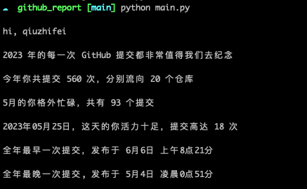

GitHub 个人年度报告。



## Usage
请在本地创建 config.ini，并写入
```
[Credentials]

# The GitHub API URL you are using，eg: https://api.github.com
API_URL=

# Your GitHub username
USER_NAME=

# Your GitHub Personal Access Token obtained from /settings/tokens, eg: https://github.com/settings/tokens
TOKEN=
```
运行
```
python main.py
```
